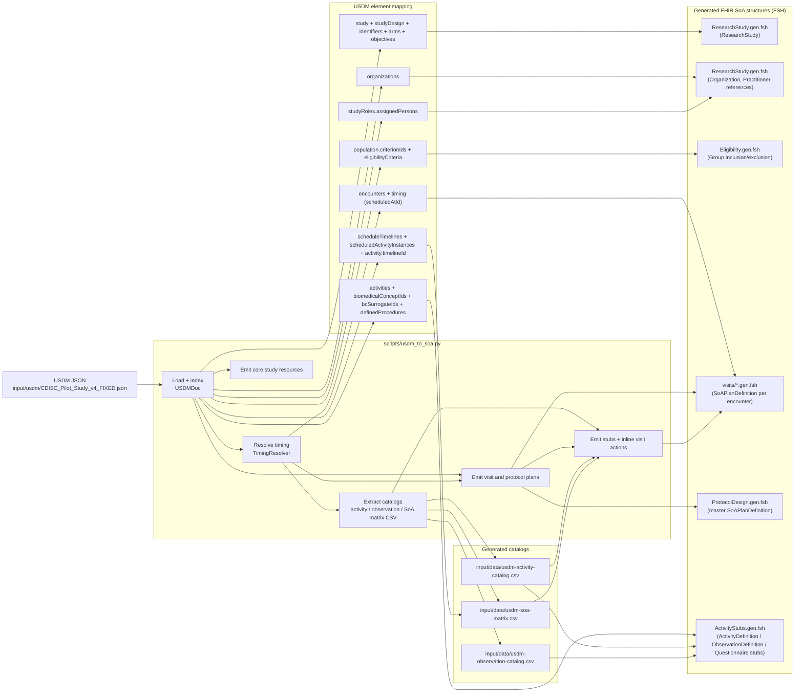
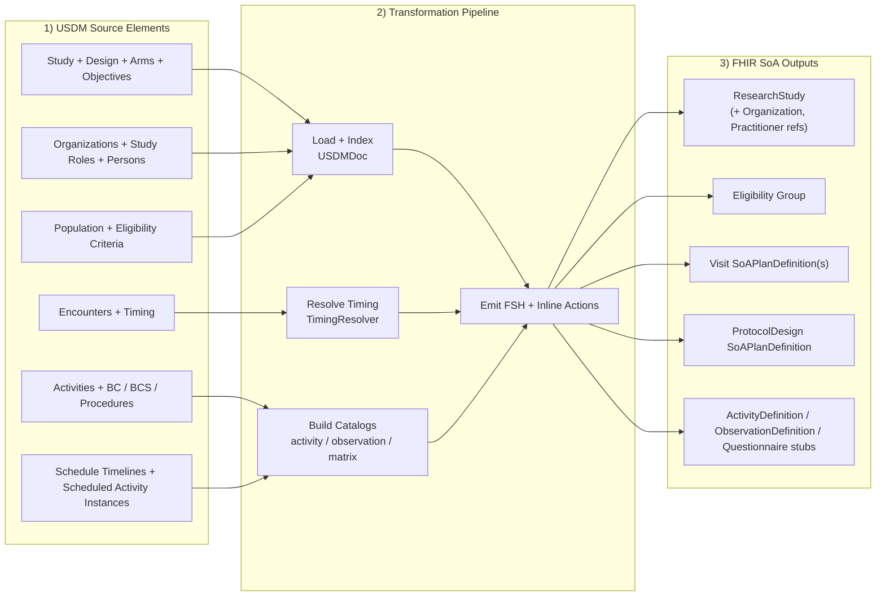

# USDM to FHIR SoA Mapping Summary Diagram

This diagram summarizes how the USDM source file is transformed by the Phase F
pipeline into FHIR SoA structures and supporting artifacts.

## Reading Notes

- The pipeline is deterministic and idempotent: unchanged USDM input yields
  byte-identical generated outputs.
- `usdm-activity-catalog.csv` and `usdm-soa-matrix.csv` are used twice:
  first as extracted artifacts, then to add activity/action details to visit
  PlanDefinitions.
- Activity classification precedence is:
  `biomedicalConceptIds` -> measurement,
  `bcSurrogateIds` -> instrument/questionnaire,
  `definedProcedures` -> procedure.

## Slide-Friendly Diagram (Compact)

Use this version when you need a single-slide summary focused on source
elements, transformation stages, and final SoA resource families.

